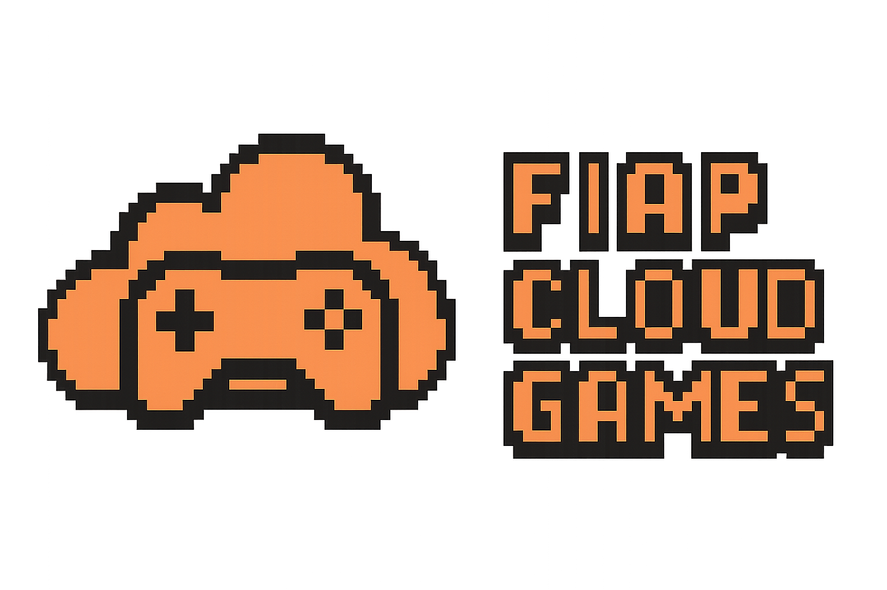

<h1 align="center">
  
</h1>

<div align="center">


</div>

<div align="center">

[](./README.en.md)
[](./README.md)

</div>

<div align="center">

[Objectives](#-objectives)&nbsp;&nbsp;&nbsp;|&nbsp;&nbsp;&nbsp;
[Features](#-features)&nbsp;&nbsp;&nbsp;|&nbsp;&nbsp;&nbsp;
[Authentication and Security](#-authentication-and-security)&nbsp;&nbsp;&nbsp;|&nbsp;&nbsp;&nbsp;
[Technologies](#-technologies)&nbsp;&nbsp;&nbsp;|&nbsp;&nbsp;&nbsp;
[API Documentation](#-api-documentation)&nbsp;&nbsp;&nbsp;|&nbsp;&nbsp;&nbsp;
[How to Run](#️-how-to-run)

</div>

---

## 🎯 Objectives

The goal is to build a **.NET 9 REST API** to manage users and their acquired games, serving as a foundation for future features such as matchmaking and game server orchestration.

This MVP allows FIAP to validate the proposed architecture, ensuring security, scalability, and best practices from the first version.

---

## 🚀 Features

### User Registration
- Register with name, email, and secure password
- Email format and password strength validation

### Authentication and Authorization
- Authentication via **JWT stored in `HttpOnly` cookies**
- Access levels:
  - Regular user
  - Administrator (access to privileged resources)

### Management
- Game creation and listing (admin)
- User's game library
- Prepared structure for campaigns and promotions

---

## 🔐 Authentication and Security

The API uses **JWT stored in `HttpOnly` cookies**, protecting tokens against XSS attacks. The system also includes:

- **Refresh Tokens**: session renewal without re-login
- **RBAC**: Role-based access control (`Admin`, `User`)
- **SignalR**: Real-time forced logout, ideal for session revocation
- **Custom middlewares**: global error handling and structured logging

---

## 🛠 Technologies

- [.NET 9](https://dotnet.microsoft.com/)
- **Entity Framework Core**
- **JWT + Refresh Token**
- **SignalR** (WebSockets)
- **Swagger/OpenAPI**
- **FluentValidation**
- **Serilog + Seq** (observability)
- **Docker Compose**
- **PostgreSQL**

---

## 📚 API Documentation

- Swagger: [`http://localhost:5000/swagger`](http://localhost:5000/swagger)  
- Seq (logs): [`http://localhost:8081`](http://localhost:8081)

---

## ⚙️ How to Run

### Prerequisites

- [.NET 9 SDK](https://dotnet.microsoft.com/en-us/download)
- [Docker](https://www.docker.com/products/docker-desktop)
- CLI EF Core (`dotnet-ef`)

### 🔧 Environment Configuration

Edit the `appsettings.Development.json` file with the following settings to configure the database, JWT, and logging:

```json
{
  "ConnectionStrings": {
    "Database": "Host=postgres;Port=5432;Database=fcg;Username=root;Password=root;Include Error Detail=true"
  },
  "Jwt": {
    "Secret": "cc95adbf68f11e9bcb0274d826dfcfc88b790c50",
    "Issuer": "fiap-cloud-games",
    "Audience": "developers",
    "ExpirationInMinutes": 10
  },
  "AuthKeys": {
    "AccessToken": "access_token",
    "RefreshToken": "refresh_token"
  },
  "CORsWhitelistedDomains": [
    "http://localhost:3000"
  ],
  "Serilog": {
    "Using": ["Serilog.Sinks.Console", "Serilog.Sinks.Seq"],
    "WriteTo": [
      { "Name": "Console" },
      {
        "Name": "Seq",
        "Args": { "ServerUrl": "http://seq:5341" }
      }
    ],
    "MinimumLevel": {
      "Default": "Information",
      "Override": { "Microsoft": "Information" }
    },
    "Enrich": ["FromLogContext", "WithMachineName", "WithThreadId"]
  }
}
```

💡 **Important**: The postgres host should only be used when the database is running via Docker Compose. For CLI-based migrations locally, temporarily switch the host to localhost.

### ▶️ Starting the System

You can start the system in two ways:

#### ✅ Option 1: Using Docker Compose (recommended)

```bash
docker-compose up --build
```
Make sure docker-compose is set as the startup project in Visual Studio, or run the command above in the terminal.

The API will be available at:

- `http://localhost:5000/swagger`
- `http://localhost:8081` (log visualization via Seq)

#### 🛠️ Opção 2: Manual Execution

1. Start the PostgreSQL database manually (locally or via Docker)
2. Update the connection string to use `localhost`
3. Apply the migrations:
```bash
dotnet ef database update
```
4. Run the application:
```bash
dotnet run --project src/Fcg.Api
```
💡 **Important**: Review the database connection variables in the docker-compose file.

